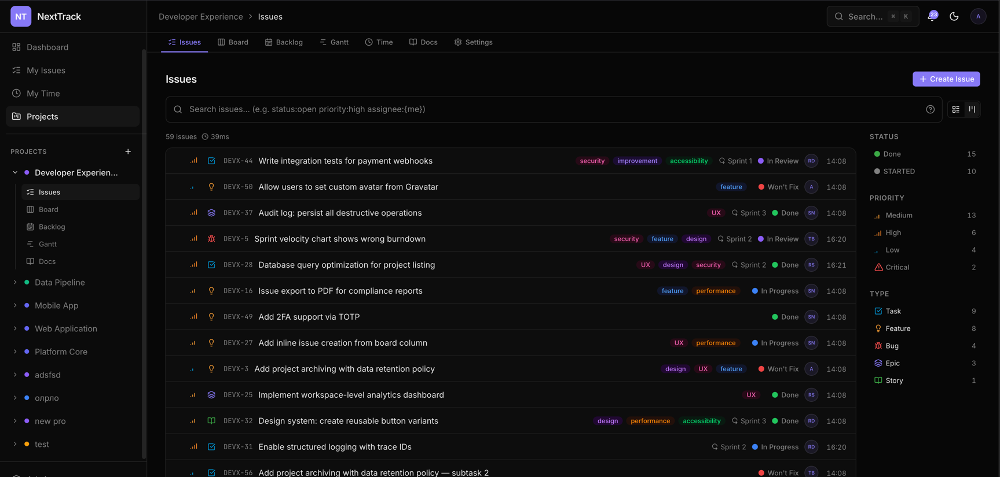
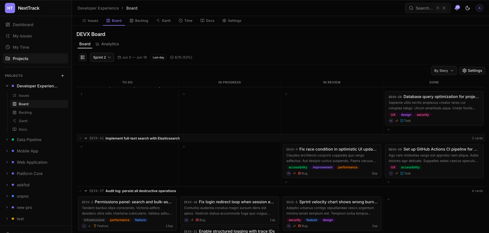
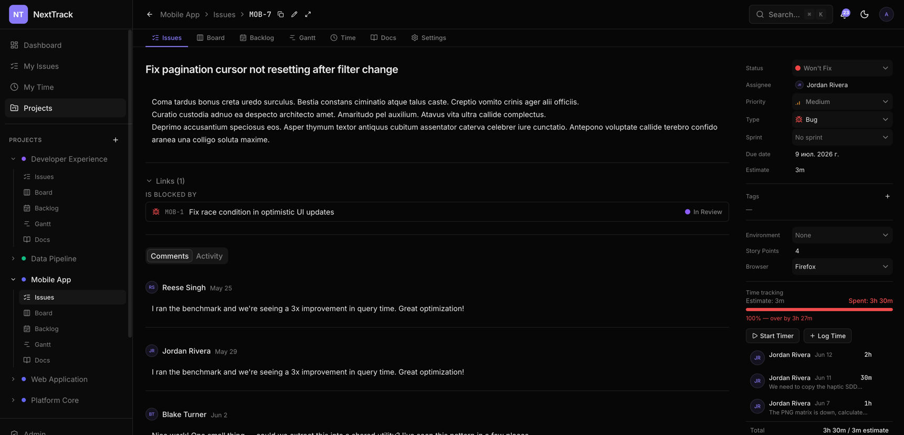
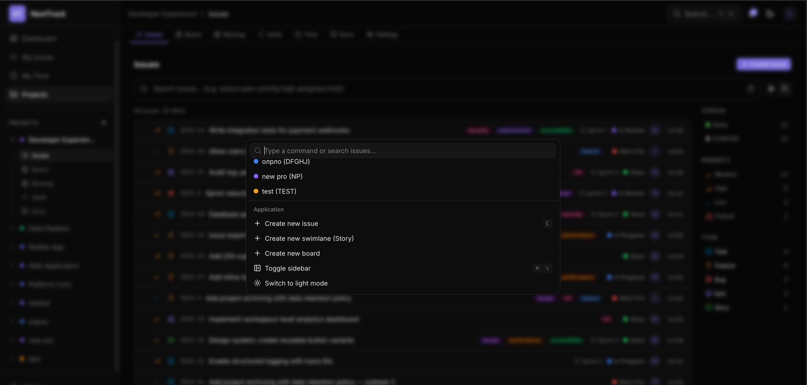
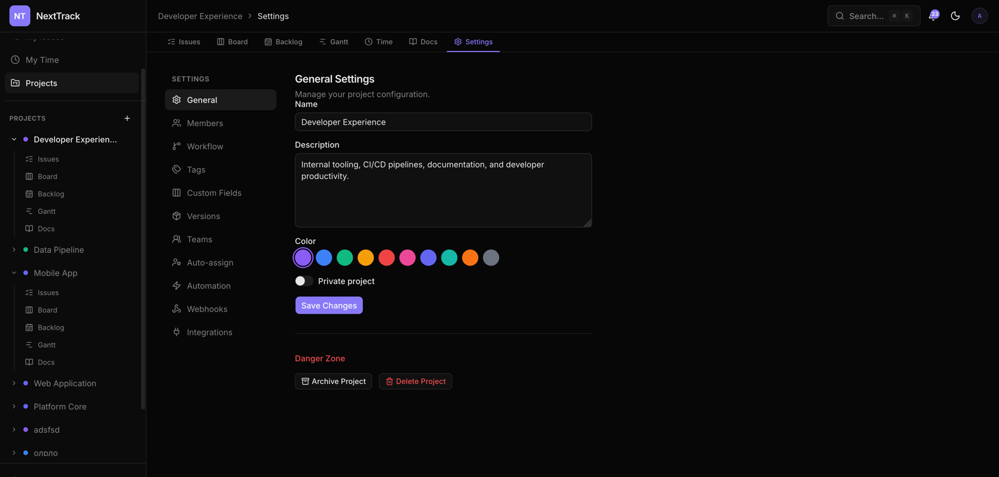

# NextTrack

> Open-source project management tool inspired by YouTrack. Built as a monorepo with NestJS + Next.js.


**[🌐 Live landing & interactive demos](https://ramils.github.io/nexttrack/)**

---

## Features

- **Issues** -- create, assign, prioritize, track with custom workflows and statuses
- **Agile Boards** -- Kanban boards with drag-and-drop (dnd-kit), swimlanes, WIP limits
- **Sprints** -- sprint planning, backlog grooming, velocity tracking
- **Custom Fields & Workflows** -- configurable per-project statuses, transitions, and field schemas
- **Rich Text Editor** -- Tiptap-based editor with mentions, task lists, code blocks, images
- **Full-Text Search** -- Elasticsearch-powered search with structured query language
- **Time Tracking** -- log work, view time reports with Recharts
- **Real-Time Updates** -- Socket.IO with Valkey adapter for live collaboration
- **SSO** -- Google and Microsoft OAuth, plus invite-only email registration
- **File Attachments** -- upload to MinIO/S3 with presigned URLs
- **Notifications** -- in-app + email notifications via BullMQ background jobs
- **Activity Feed** -- full audit trail of issue changes, comments, and status transitions
- **Dark/Light Theme** -- oklch-based design tokens with `next-themes`

## Screenshots

| Issue list | Agile board |
|---|---|
|  |  |
| **Issue detail** | **Command palette** |
|  |  |
| **Project settings** | |
|  | |

## Tech Stack

| Backend (apps/api)           | Frontend (apps/web) |
|------------------------------|---|
| NestJS 11                    | Next.js 16 |
| PostgreSQL 16 (Prisma 7 ORM) | React 19 |
| Valkey 9 (ioredis)           | TanStack Query 5 |
| Elasticsearch 9              | Zustand 5 |
| MinIO / S3                   | Tiptap 3 (rich text) |
| BullMQ (job queues)          | shadcn/ui (base-nova) |
| Socket.IO (real-time)        | dnd-kit (drag & drop) |
| Passport + JWT               | Recharts 3 |
| Zod (validation)             | Tailwind CSS 4 |
| Swagger (API docs)           | socket.io-client |

## Prerequisites

| Tool | Version |
|---|---|
| Node.js | >= 22 |
| pnpm | >= 9 |
| Docker & Docker Compose | Latest |

## Quick Start (Development)

### 1. Clone and install

```bash
git clone https://github.com/ramilS/nexttrack.git
cd next_track
pnpm install
```

### 2. Start infrastructure

```bash
cd infra && docker compose up -d
```

This starts PostgreSQL, Valkey, Elasticsearch, MinIO, and Mailhog.

### 3. Configure environment

```bash
cp .env.example .env
# Review .env and adjust values if needed (defaults work with docker compose)
```

### 4. Set up the database

```bash
cd apps/api
pnpm prisma:migrate
pnpm prisma:generate
```

### 5. Create admin user

```bash
cd apps/api && pnpm seed
```

Credentials are printed to the console. Optionally set `ADMIN_EMAIL` and `ADMIN_PASSWORD` env vars.

### 6. (Optional) Load demo data

```bash
cd apps/api && pnpm seed:dev
```

Creates 20 users, 5 projects, ~50 issues per project, plus comments, sprints, and time logs. All demo users share password `Password123!`.

> **Heads up:** seeding writes only to Postgres and bypasses the search indexer.
> The project issue list is Elasticsearch-backed (`GET /search`), so seeded issues
> won't appear in the list until you reindex — see step 8.

### 7. Start development

```bash
# From repo root -- starts both API (:3001) and Web (:3000)
pnpm dev
```

Open [http://localhost:3000](http://localhost:3000) in your browser.

### 8. Reindex Elasticsearch (after seeding)

The issue list reads from Elasticsearch, and seeding doesn't touch the index, so
reindex once after `pnpm seed:dev` (the seed output also prints this exact curl):

```bash
# 1) log in as admin (saves the httpOnly auth cookies)
curl -c /tmp/nt-cookies.txt -X POST http://localhost:3001/api/auth/login \
  -H 'Content-Type: application/json' \
  -d '{"email":"admin@nexttrack.local","password":"Password123!"}'

# 2) trigger a full reindex (admin only) -> {"indexed":N,"errors":0}
curl -b /tmp/nt-cookies.txt -X POST http://localhost:3001/api/search/reindex \
  -H 'Content-Type: application/json' -d '{}'
```

## API Documentation (Swagger)

The API exposes an OpenAPI/Swagger UI, **disabled by default**. Enable it with the
`SWAGGER_ENABLED` env var:

```bash
# from apps/api
SWAGGER_ENABLED=true pnpm dev
```

Then open [http://localhost:3001/docs](http://localhost:3001/docs). On startup the
API logs the exact URL. Note: Swagger UI is served at `/docs`, **not** under the
`/api` prefix — `SwaggerModule.setup()` ignores the app's global prefix unless
`useGlobalPrefix: true` is passed (it isn't here).

## Production Deployment

### Using Docker Compose

1. Copy and fill production env:
   ```bash
   cp .env.example .env.prod
   # Set real DATABASE_URL, JWT secrets, SMTP credentials, S3 config, etc.
   ```

2. Run the deploy script:
   ```bash
   cd infra
   DOMAIN=your-domain.com EMAIL=admin@your-domain.com ./deploy-init.sh
   ```
   This bootstraps SSL certificates via Let's Encrypt and starts the full stack.

### Docker Images

Images are built on every push to `main` and published to GitHub Container Registry:

```
ghcr.io/<your-org>/next_track/api:latest
ghcr.io/<your-org>/next_track/web:latest
```

Tagged releases produce semver-tagged images (`v1.0.0`, `v1.0`).

## Project Structure

```
next_track/
├── apps/
│   ├── api/                  NestJS REST API + WebSocket server (port 3001)
│   ├── web/                  Next.js frontend (port 3000)
│   └── e2e/                  Playwright E2E tests (Testcontainers)
├── packages/
│   ├── shared/               Shared types, error codes, constants
│   ├── ui/                   Shared shadcn/ui component library
│   ├── eslint-config/        Shared ESLint configuration
│   └── typescript-config/    Shared TypeScript config presets
├── infra/
│   ├── docker-compose.yml    Dev services (postgres, valkey, es, minio, mailhog)
│   ├── docker-compose.prod.yml   Production stack with nginx
│   ├── nginx/                Reverse proxy config + SSL params
│   ├── deploy-init.sh        First-time deployment bootstrap
│   └── init-ssl.sh           SSL certificate helper
└── .github/workflows/
    ├── ci.yml                Lint, type check, unit tests, build
    ├── e2e.yml               Playwright E2E tests
    └── docker.yml            Docker build & push to GHCR
```

## Scripts

### Root

| Command | Description |
|---|---|
| `pnpm dev` | Start all apps in development mode |
| `pnpm build` | Build all apps and packages |
| `pnpm lint` | Lint all apps and packages |
| `pnpm check-types` | Type check all apps and packages |
| `pnpm format` | Format code with Prettier |
| `pnpm test:e2e` | Run Playwright E2E tests (requires Docker + build) |

### API (`apps/api`)

| Command | Description |
|---|---|
| `pnpm dev` | Start API with hot reload |
| `pnpm build` | Build for production |
| `pnpm start:prod` | Run production build |
| `pnpm test` | Run unit tests |
| `pnpm test:integration` | Run integration tests (requires Docker) |
| `pnpm test:e2e` | Run end-to-end tests |
| `pnpm seed` | Create initial admin user |
| `pnpm seed:dev` | Populate DB with demo data |
| `pnpm prisma:migrate` | Run database migrations |
| `pnpm prisma:studio` | Open Prisma Studio GUI |
| `pnpm prisma:generate` | Regenerate Prisma client |

### Web (`apps/web`)

| Command | Description |
|---|---|
| `pnpm dev` | Start frontend with hot reload |
| `pnpm build` | Build for production |
| `pnpm check-types` | Type check |

## How to Run Tests

### Unit Tests

```bash
# API (Jest)
cd apps/api && pnpm test

# Web (Vitest)
cd apps/web && pnpm test
```

### Integration Tests

API integration tests use Testcontainers for real PostgreSQL + Valkey:

```bash
cd apps/api && pnpm test:integration    # requires Docker
```

### E2E Tests (Playwright)

Full browser tests covering authentication, project CRUD, issue CRUD, board view, and page navigation. Infrastructure is fully automated via Testcontainers.

**Prerequisites**: Docker running, both apps built.

```bash
# Build both apps first
pnpm build

# Run all E2E tests (headless)
pnpm test:e2e

# Or from the e2e directory with more options:
cd apps/e2e
pnpm exec playwright install chromium     # first time only
pnpm test:e2e                             # headless, 23 tests
pnpm test:e2e:ui                          # interactive Playwright UI (best for debugging)
pnpm test:e2e:headed                      # visible browser window
pnpm test:e2e:report                      # open HTML report after run

# Run a single spec
pnpm exec playwright test tests/01-auth.spec.ts
```

**How it works:**

1. `global-setup.ts` starts PostgreSQL 16 + Valkey 9 containers, pushes Prisma schema, seeds data, then starts NestJS API + Next.js on random ports
2. `auth.setup.ts` logs in via UI and saves browser state for all other tests
3. Tests use Page Object Model (`pages/*.page.ts`) for clean locator management
4. `global-teardown.ts` stops servers and containers

**Test coverage (23 tests):**

| Spec | Tests | Covers |
|------|-------|--------|
| `01-auth.spec.ts` | 4 | Login form, sidebar, navigation links |
| `02-project-crud.spec.ts` | 3 | List, create, navigate to project |
| `03-issue-crud.spec.ts` | 3 | List, create, open issue detail |
| `04-board-view.spec.ts` | 4 | Board page, tabs, columns |
| `05-smoke-navigation.spec.ts` | 8 | All pages load, no console errors |

See [`apps/e2e/README.md`](apps/e2e/README.md) for architecture details, Page Objects, and troubleshooting.

## Environment Variables

All variables are documented in `.env.example`. Key groups:

### Application

| Variable | Required | Description |
|---|---|---|
| `NODE_ENV` | Yes | `development` or `production` |
| `API_PORT` | No | API server port (default: `3001`) |
| `API_URL` | Yes | Full API URL (e.g. `http://localhost:3001`) |
| `WEB_URL` | Yes | Full frontend URL (e.g. `http://localhost:3000`) |
| `SWAGGER_ENABLED` | No | Serve Swagger UI at `/docs` (default: `false`) |

### Database

| Variable | Required | Description |
|---|---|---|
| `DATABASE_URL` | Yes | PostgreSQL connection string |
| `DATABASE_POOL_MIN` | No | Min pool connections (default: `2`) |
| `DATABASE_POOL_MAX` | No | Max pool connections (default: `10`) |

### Authentication

| Variable | Required | Description |
|---|---|---|
| `JWT_ACCESS_SECRET` | Yes | JWT signing key (min 32 chars) |
| `JWT_REFRESH_SECRET` | Yes | Refresh token signing key (min 32 chars) |
| `JWT_ACCESS_EXPIRES_IN` | No | Access token TTL (default: `15m`) |
| `JWT_REFRESH_EXPIRES_IN` | No | Refresh token TTL (default: `30d`) |
| `ENCRYPTION_KEY` | Yes (prod) | 32-byte hex key for SSO secrets |

### Infrastructure

| Variable | Required | Description |
|---|---|---|
| `VALKEY_URL` | Yes | Valkey connection string |
| `ELASTICSEARCH_URL` | Yes | Elasticsearch endpoint |
| `MINIO_ENDPOINT` | Yes | MinIO/S3 host |
| `MINIO_ACCESS_KEY` | Yes | S3 access key |
| `MINIO_SECRET_KEY` | Yes | S3 secret key |
| `MINIO_BUCKET` | Yes | S3 bucket name |

### Mail

| Variable | Required | Description |
|---|---|---|
| `MAIL_HOST` | Yes | SMTP host (`localhost` for Mailhog in dev) |
| `MAIL_PORT` | Yes | SMTP port (`1025` for Mailhog) |
| `MAIL_FROM` | Yes | Sender address |
| `MAIL_USER` | No | SMTP username (production) |
| `MAIL_PASS` | No | SMTP password (production) |

### Observability / Tracing (optional, off by default)

| Variable | Required | Description |
|---|---|---|
| `OTEL_ENABLED` | No | Enable OpenTelemetry tracing (default: `false`) |
| `OTEL_SERVICE_NAME` | No | Service name in traces (default: `nexttrack-api`) |
| `OTEL_EXPORTER_OTLP_ENDPOINT` | No | OTLP/HTTP base endpoint (default: `http://localhost:4318`) |
| `OTEL_SAMPLE_RATIO` | No | Trace sample ratio `0`–`1` (default: `1`) |

To view traces locally: set `OTEL_ENABLED=true`, uncomment the `jaeger` service in
`infra/docker-compose.yml`, start it, then open the Jaeger UI at `http://localhost:16686`.
Tracing internals (single config in `apps/api/src/tracing.ts`, outbox `traceparent`
propagation) are documented in `.claude/rules/nestjs-async-safety.md`.

## License

MIT
